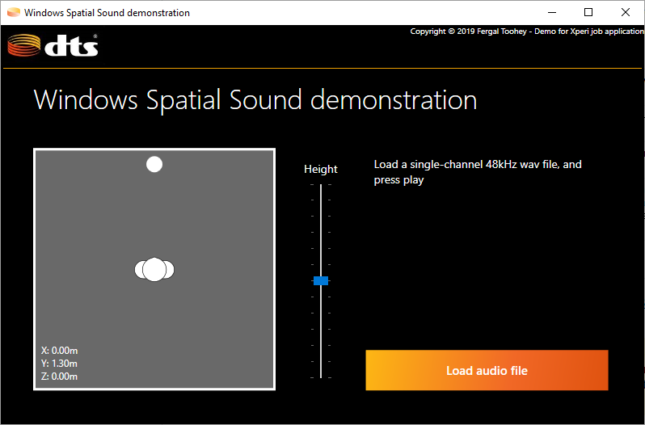

# Windows Spatial Sound and WPF demonstration.

Demonstration project for Xperi job application.

User can load a 48kHz mono wav file, and move the audio emitter's location in three dimensions.

For convenience, a 48kHz mono wav file can be found in the Resources/Audio folder.

# Drivers
To obtain 3D spatial sound, enable DTS Headphone:X for your selected audio device:

