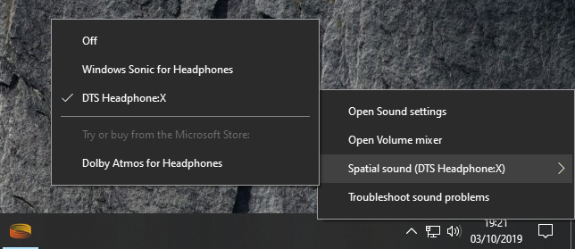

# Windows Spatial Sound and WPF demonstration.

# Usage
Project can be run from source by cloning/downloading repository and opening solution in Visual Studio.

Alternatively, the application binary can be installed from the release page https://github.com/fergalt/SpatialSoundDemo2/releases

# About
Demonstration project: not intended for distribution. WPF desktop app, which utilises the Audiograph / Spatial Sound features from the UWP Windows.Media.Audio namespace. Tested on Windows 10, Version 1903. 

User can load a 48kHz mono wav file, and move the audio emitter's location in three dimensions.

For convenience, a 48kHz mono wav file can be found in the Resources/Audio folder.

# Drivers
To obtain 3D spatial sound, enable DTS Headphone:X for your selected audio device:

